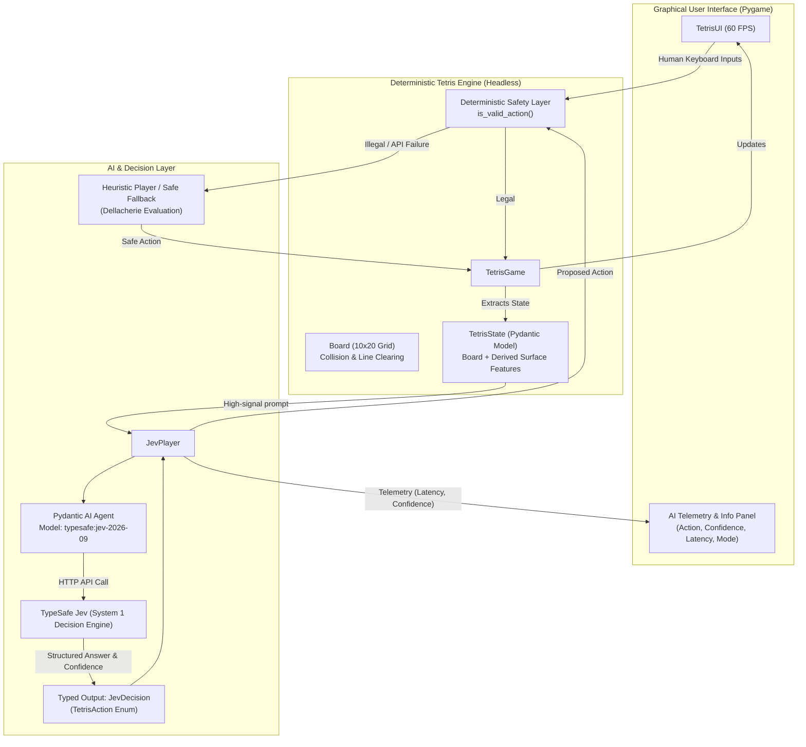

# Autonomous Tetris with TypeSafe Jev AI (Pydantic AI)

An autonomous, typed-decision Tetris game powered by **TypeSafe Jev** and **Pydantic AI**, featuring both an interactive **Human Play Mode** and a fully autonomous **Jev AI Mode**.

Built with a modular engine decoupled from the **Pygame** graphical interface, a deterministic safety layer, real-time telemetry, and a traditional heuristic evaluation AI for benchmarking.

---

## Architecture Diagram



---

## Table of Contents

1. [Overview](#overview)
2. [How Tetris Works](#how-tetris-works)
3. [What Jev Is Doing](#what-jev-is-doing)
4. [Project Structure](#project-structure)
5. [Installation](#installation)
6. [Environment Variables](#environment-variables)
7. [How to Run](#how-to-run)
8. [Controls](#controls)
9. [How Jev Chooses Actions](#how-jev-chooses-actions)
10. [Confidence Scoring](#confidence-scoring)
11. [Deterministic Safety & Error Handling](#deterministic-safety--error-handling)
12. [Offline / Mock AI Mode](#offline--mock-ai-mode)
13. [AI Comparison Mode (Jev vs. Heuristic)](#ai-comparison-mode-jev-vs-heuristic)
14. [Running the Test Suite](#running-the-test-suite)

---

## Overview

Unlike standard conversational LLMs that generate free-form text or code, **TypeSafe Jev** is a fast "System One" decision model launched by TypeSafe AI. It accepts input context and directly fills strictly-typed Pydantic schemas (such as Enums and bounded types) with calibrated probability and confidence scores at low latency (70–300 ms).

This project integrates Jev into a live Tetris game:
- **Human Mode**: Play using standard keyboard controls.
- **Jev AI Mode**: Jev observes the game state, evaluates surface topology, selects typed actions, and the engine executes them autonomously in real time.
- **Heuristic AI Mode**: A traditional Pierre Dellacherie evaluation engine for performance comparison and resilient fallback.

---

## How Tetris Works

1. **Grid**: A standard 10 columns by 20 rows matrix.
2. **Tetrominoes**: All 7 standard pieces: `I`, `O`, `T`, `S`, `Z`, `J`, `L`.
3. **Spawning**: Pieces are generated using a fair, authentic **7-bag randomizer**.
4. **Rotations**: 4 discrete orientations per piece with standard wall-kick offsets.
5. **Drop Mechanics**:
   - **Soft Drop**: Moves the piece down 1 row (+1 point per row).
   - **Hard Drop**: Instantly locks the piece at the floor (+2 points per row dropped).
6. **Line Clearing & Scoring**:
   - 1 Line: $100 \times \text{Level}$
   - 2 Lines: $300 \times \text{Level}$
   - 3 Lines: $500 \times \text{Level}$
   - 4 Lines (Tetris): $800 \times \text{Level}$
7. **Hold Mechanism**: Swap the falling piece with the hold queue (once per lock).
8. **Game Over**: Triggered when a newly spawned piece collides with existing blocks at the ceiling.

---

## What Jev Is Doing

Jev acts as the real-time player:

```text
Game State (Board + Heights + Holes + Bumpiness)
                      │
                      ▼
               Pydantic AI Agent
                      │
                      ▼
               TypeSafe Jev API
                      │
                      ▼
          JevDecision(action=TetrisAction.ROTATE_CW)
                      │
                      ▼
        Engine Validation (is_valid_action)
                      │
                      ▼
             Execute in Engine
                      │
                      ▼
               Render in Pygame
```

Jev does **not** generate textual instructions like `"Move three positions left"`. It directly returns a validated Python `TetrisAction` enum member.

---

## Project Structure

```text
C:\Users\Asus\Desktop\jev test/
├── app.py                      # Main entrypoint (GUI, CLI, comparison benchmarks)
├── requirements.txt            # Dependency specifications
├── .env.example                # Template for environment configuration
├── .env                        # Local environment variables (API keys)
├── README.md                   # Complete architectural and usage documentation
│
├── game/                       # Decoupled headless Tetris engine
│   ├── __init__.py             # Exports Board, TetrisGame, TetrisAction, etc.
│   ├── actions.py              # Discrete TetrisAction enum
│   ├── board.py                # 10x20 grid, collision detection, line clearing
│   ├── pieces.py               # Tetromino matrices, rotations, color palette
│   ├── state.py                # Pydantic model for game state & telemetry
│   └── tetris.py               # Headless game loop, gravity, scoring, hold
│
├── ai/                         # Autonomous AI agents & decision modules
│   ├── __init__.py             # Exports JevPlayer, HeuristicPlayer, schemas
│   ├── schemas.py              # Pydantic schemas (JevDecision, DecisionResult)
│   ├── features.py             # Pure functions calculating surface metrics
│   ├── prompts.py              # System prompt and state formatter for Jev
│   ├── jev_player.py           # Jev AI agent integration via Pydantic AI
│   └── heuristic_player.py     # Dellacherie heuristic AI & safe fallback
│
├── ui/                         # Modern graphical presentation layer
│   ├── __init__.py             # Exports TetrisUI
│   └── pygame_ui.py            # Pygame rendering, ghost piece, telemetry panel
│
└── tests/                      # Comprehensive test suite
    ├── test_pieces.py          # Piece shapes, rotations, bounding boxes
    ├── test_board.py           # Collisions, boundaries, line clears
    ├── test_features.py        # Column heights, holes, bumpiness, wells
    ├── test_game.py            # Gravity, drops, hold piece, scoring
    ├── test_actions.py         # Deterministic safety layer validation
    ├── test_heuristic.py       # Heuristic placement and simulation
    └── test_jev_integration.py # Mocked Jev calls, fallbacks, continuous loop
```

---

## Installation

### Prerequisites
- Python 3.10+ (tested on Python 3.13)
- Windows / macOS / Linux

### Install Dependencies

```bash
pip install -r requirements.txt
```

Or install the packages directly:

```bash
pip install "pydantic-ai-slim[typesafe]" pygame pydantic python-dotenv pytest
```

---

## Environment Variables

Create or edit your `.env` file in the project root:

```ini
# TypeSafe API Key for Jev
TYPESAFE_API_KEY=your_typesafe_api_key_here

# Pinned Jev model version (e.g., jev-2026-09 or jev-latest)
TYPESAFE_MODEL=jev-2026-09

# Default AI decision interval in milliseconds
AI_DECISION_INTERVAL_MS=250

# Initial game mode: human, jev, heuristic
DEFAULT_MODE=human
```

> **Note**: If `TYPESAFE_API_KEY` is omitted or empty, the application automatically boots into **Mock / Offline Mode**, allowing full autonomous gameplay without an active API subscription.

---

## How to Run

### 1. Interactive GUI (Human Mode by default)
```bash
python app.py
```

### 2. Start Directly in Autonomous Jev AI Mode
```bash
python app.py --mode jev
```

### 3. Start in Offline Mock AI Mode (No API key needed)
```bash
python app.py --mode jev --mock
```

### 4. Start in Traditional Heuristic AI Mode
```bash
python app.py --mode heuristic
```

### 5. Run Headless AI Comparison Benchmark
Run automated headless matches comparing Jev AI against the Heuristic AI:
```bash
python app.py --headless --mock --games 5
```

---

## Controls

### Keyboard Controls

| Key | Mode | Action |
| :--- | :--- | :--- |
| `Left Arrow` | Human | Move piece left |
| `Right Arrow` | Human | Move piece right |
| `Up Arrow` | Human | Rotate Clockwise (CW) |
| `Z` | Human | Rotate Counter-Clockwise (CCW) |
| `Down Arrow` | Human | Soft Drop (fall faster) |
| `Spacebar` | Human | Hard Drop (instant lock) |
| `C` / `Shift` | Human | Hold Piece (swap with hold queue) |
| `TAB` or `M` | **Global** | **Toggle Human / Jev AI Mode** |
| `H` | **Global** | Toggle Heuristic AI / Jev AI |
| `1` | **Global** | Set AI Speed: **Slow** (500 ms) |
| `2` | **Global** | Set AI Speed: **Normal** (250 ms) |
| `3` | **Global** | Set AI Speed: **Fast** (100 ms) |
| `P` | **Global** | Pause / Resume Game |
| `R` | **Global** | Restart Match |

---

## How Jev Chooses Actions

Rather than processing heavy raw image arrays or text streams, the game engine serializes the board into derived topological features:

```python
class TetrisState(BaseModel):
    board: list[list[int]]          # 20x10 binary matrix (0=empty, 1=occupied)
    current_piece: str              # Active falling piece (I, O, T, S, Z, J, L)
    current_x: int                  # Active horizontal column
    current_y: int                  # Active vertical row
    rotation: int                   # Orientation index (0..3)
    next_piece: str | None          # Next piece in queue
    hold_piece: str | None          # Stored hold piece
    aggregate_height: int           # Sum of all column heights
    maximum_height: int             # Maximum column height
    holes: int                      # Covered empty cells
    bumpiness: int                  # Sum of |height[i] - height[i+1]|
    completed_lines: int            # Full rows waiting to clear
    score: int
    level: int
    lines_cleared: int
    game_over: bool
```

This state is formatted into a prompt and submitted to Jev via `pydantic_ai.Agent`.
Jev evaluates the decision objectives and returns:

```python
class JevDecision(BaseModel):
    action: TetrisAction = Field(
        description="Choose exactly one action that should be executed next."
    )
```

---

## Confidence Scoring

TypeSafe Jev returns calibrated probability distributions for each discrete choice. When using Pydantic AI, these are extracted from:

```python
run_result.response.provider_details["confidence"]["action"]
```

The on-screen telemetry displays:
- A numeric score (e.g. `0.92`) when available from the TypeSafe provider.
- `Confidence: N/A` if confidence is not exposed by the current provider or mock model.

---

## Deterministic Safety & Error Handling

To guarantee the game never crashes or performs invalid operations, all AI decisions pass through a **Deterministic Safety Layer**:

1. **Legality Verification**:
   ```python
   if game.is_valid_action(action):
       game.apply_action(action)
   else:
       fallback()
   ```
2. **Graceful Fallbacks**:
   If Jev returns an illegal move (e.g., trying to move left into a wall), times out, or encounters a network error, the engine automatically defers to the built-in deterministic heuristic fallback.
3. **Asynchronous Threading**:
   AI network calls execute on a background worker thread pool (`ThreadPoolExecutor`). Even if a cloud API request takes 400ms, the Pygame UI continues rendering smoothly at 60 FPS without stutter or dropped frames.

---

## Offline / Mock AI Mode

To test or demonstrate the autonomous player without an API key or when offline:
```bash
python app.py --mode jev --mock
```
In mock mode, the agent uses the local deterministic evaluation engine, simulating decision latency and allowing full autonomous gameplay indefinitely.

---

## AI Comparison Mode (Jev vs. Heuristic)

The project includes an evaluation function based on the Dellacherie Tetris algorithm:

$$\text{Score} = w_1 \cdot \text{lines} + w_2 \cdot \text{aggregate\_height} + w_3 \cdot \text{holes} + w_4 \cdot \text{bumpiness} + w_5 \cdot \text{landing\_height}$$

You can switch between Jev AI and Heuristic AI dynamically during gameplay with the **`H`** key, or run a headless comparison:

```bash
python app.py --headless --mock --games 3
```

Benchmark output example:
```text
=================================================================
                   BENCHMARK RESULTS
=================================================================
Metric                    | Jev AI           | Heuristic AI    
-----------------------------------------------------------------
Average Score             | 13255.0          | 13255.0         
Average Lines Cleared     | 37.5             | 37.5            
Avg Latency (ms)          | 12.0             | 0.0             
Total Decisions           | 943              | 943             
=================================================================
```

---

## Running the Test Suite

The test suite contains 35 unit and integration tests covering pieces, board physics, feature calculations, deterministic action validation, resilience, and mock Jev loops:

```bash
python -m pytest -v
```

All 35 tests pass with zero warnings or errors.
